<picture>
  <source media="(prefers-color-scheme: dark)" srcset="./assets/header-dark.svg">
  <source media="(prefers-color-scheme: light)" srcset="./assets/header-light.svg">
  
</picture>

<picture>
  <source media="(prefers-color-scheme: dark)" srcset="./assets/verified-dark.svg">
  <source media="(prefers-color-scheme: light)" srcset="./assets/verified-light.svg">
  
</picture>

I build **retrieval and agent systems that check their own output** — the part most
RAG pipelines skip. A model that answers confidently and a model that answers
correctly look identical until something measures the gap, so I spend my time on
the measuring: claim-level attribution, contradiction detection, evaluation
harnesses. Second interest is **quantitative systems** in C++, where the same
question shows up wearing different clothes: is this number right, and how fast
can I know?

B.Tech CSE at **IIIT Pune** (’29) · CGPA 9.38/10 · open to **AI/ML and quant internships**.

---

### What I've built

- **[Evidence-Aware Medical RAG](https://github.com/agarwaladarshcoding-maker/Advanced-Medical-Based-RAG-System)** — a medical QA system that splits its own draft answer into individual claims and tests each one against the passages it actually retrieved. Hybrid BM25 + dense retrieval with rank fusion and a reranker, a refusal guardrail, per-claim source attribution, and an evaluation harness scored against MedQuAD. `Python`

- **[AgentWatch](https://github.com/agarwaladarshcoding-maker/AgentWatcher)** — spawns a CLI coding agent inside a PTY and mirrors its terminal byte-for-byte, then layers on state annotations and a permission control plane that answers the agent's own y/n prompts with a logged verdict. No OS interception, no change to how the agent runs. Multi-agent sidebar, SQLite audit log. `Electron` `TypeScript` `node-pty`

- **[amber Copilot](https://github.com/agarwaladarshcoding-maker/Amber-Student-Chatbot)** — a student-housing assistant that is allowed to answer *only* from five confirmed API endpoints plus a small policy KB, with human-in-the-loop escalation. Grounding as an architectural constraint rather than a prompt instruction. `FastAPI` `Groq` `Redis`

- **[Algorithmic Portfolio Manager](https://github.com/agarwaladarshcoding-maker/Algorithmic_Portfolio_Manager)** — Modern Portfolio Theory over 20+ tickers: 5,000 simulated portfolios, efficient frontier, max-Sharpe and min-volatility optimisation, 95% VaR. `Python` `NumPy`

- **[Exotic Option Pricing Engine](https://github.com/agarwaladarshcoding-maker/Monte-Carlo-Project-Simulator)** — Monte Carlo pricer for down-and-out barrier calls under Geometric Brownian Motion, 252 discrete steps per path so the barrier is monitored properly. Mersenne Twister rather than `rand()`, drift and diffusion hoisted out of the hot loop, early exit on barrier breach. `C++17`

- **[HFT Order Matching Engine](https://github.com/agarwaladarshcoding-maker/High-Frequency-Order-Book)** — price-time priority matching over `std::map` limit books with `std::unordered_map` for O(1) order lookup, RAII throughout. Executes partial and full fills against both sides of the book. `C++17`

---

### Currently, in 2026

- Reading and re-implementing evaluation methods for retrieval — the failure mode I care about is a pipeline that scores well and is still wrong.
- Rebuilding classical ML [from scratch](https://github.com/agarwaladarshcoding-maker/ml-from-scratch) in NumPy, because I don't trust a method I can't derive.
- Competitive programming as [AdarshAg](https://codeforces.com/profile/AdarshAg) on Codeforces; 1st in the first-year contest at IIIT Pune.

<picture>
  <source media="(prefers-color-scheme: dark)" srcset="./assets/stack-dark.svg">
  <source media="(prefers-color-scheme: light)" srcset="./assets/stack-light.svg">
  
</picture>

---

### About this README

It verifies itself. A [scheduled workflow](./.github/workflows/verify.yml) re-checks
every claim above on a daily cadence — each outbound link resolves, each live
deployment answers, each linked repo is still public — then regenerates the status
strip near the top from the real result and fails the build if anything rotted.
The badge is not a decoration someone drew once; it is the output of
[`scripts/verify.py`](./scripts/verify.py), and if it goes red, it is red.

Fitting, given what I work on. A profile that asserts things about the world
should be held to the standard I'd hold a retrieval system to.

---

### Elsewhere

[Portfolio](https://know-about-adarsh.vercel.app) · [LinkedIn](https://www.linkedin.com/in/adarsh-agarwala) · [Codeforces](https://codeforces.com/profile/AdarshAg) · <a href="mailto:agarwalaadarsh.work@gmail.com">agarwalaadarsh.work@gmail.com</a>

Mentored at Smart India Hackathon 2025 · team lead, India Innovates Challenge · Coding &amp; Technical Club, IIIT Pune.

<!-- One line of personality goes a long way here — Chip Huyen mentions working as a
     Bollywood extra, Eugene Yan mentions using a Dvorak keyboard, and those are the
     details people remember. Replace this comment with something true about you. -->

